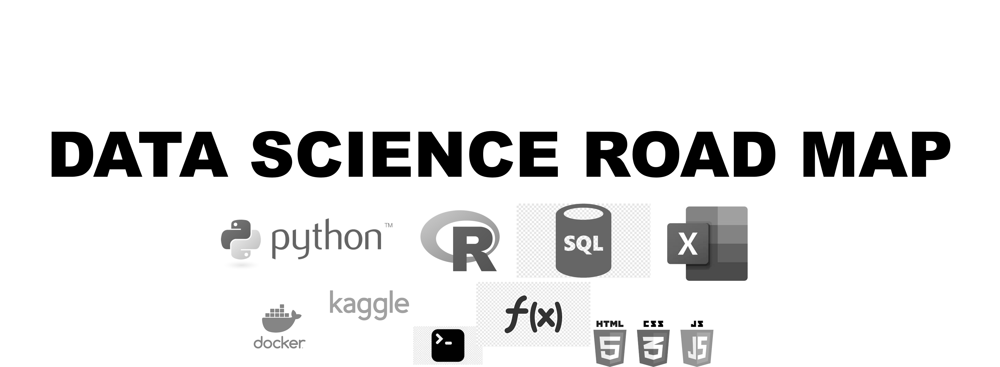

    

    
    

    

### A prioritized list of **core skills**, **reading material**, **personal portfolio projects** and **practice assignments** every new data scientist should have.

This repo is a companion site for the course [2023 CORE: Data Science and Machine Learning](https://www.udemy.com/course/draft/4287096/?referralCode=ADF695AD40B8F269D6BF). 

    
    

The goal here is very ambitious; to be the only reference site you need on your inital learning journey as a data scientist. Getting started in **data science** is hard. There is an overwhelming number of resources and suggestions. Many people give up!

The goal of this road map is to get you started (or re-directed) on your journey the right way with NO knowledge gaps. Everything from original content to linked resources has been vetted through experience and practice. 

Data jobs come in three general flavors (but are often called different things in practice); Data Analyst, General Data Scientist, and Machine Learning Engineer. The skills, course, and resources are divided into these categories for ease of reference.

## Table of Contents

1. [START LEARNING HERE - Combined Core Skills List](#combined-core-skills-list)
2. [Certification Checklist](#certification-checklist)
3. [Portfolio Project Checklist](#portfolio-project-checklist)
4. [Foundations](1-foundations)
    1. [Library Recommendations](https://github.com/isaacfab/data-science-road-map/tree/main/1-foundations#library-recommendations)
    2. [Data Science Communities](https://github.com/isaacfab/data-science-road-map/tree/main/1-foundations#data-science-communities)
    3. [Public Data](https://github.com/isaacfab/data-science-road-map/tree/main/1-foundations#public-data)
    4. [Resume Tools](https://github.com/isaacfab/data-science-road-map/tree/main/1-foundations#resume-tools)
    5. [Interview Prep](https://github.com/isaacfab/data-science-road-map/tree/main/1-foundations#interview-prep)
5. [Data Analyst](2-data-analyst)
    1. [Library Recommendations](https://github.com/isaacfab/data-science-road-map/tree/main/2-data-analyst#library-recommendations)
    2. [Cheatsheets](https://github.com/isaacfab/data-science-road-map/tree/main/2-data-analyst#cheatsheets)
    3. [Spreadsheets](https://github.com/isaacfab/data-science-road-map/tree/main/2-data-analyst#spreadsheets)
    4. [SQL](https://github.com/isaacfab/data-science-road-map/tree/main/2-data-analyst#sql)
    5. [Business Intelligence](https://github.com/isaacfab/data-science-road-map/tree/main/2-data-analyst#business-intelligence)
6. [General Data Scientist](3-general-data-scientist)
    1. [Library Recommendations](https://github.com/isaacfab/data-science-road-map/tree/main/3-general-data-scientist#library-recommendations)
    2. [Cheatsheets](https://github.com/isaacfab/data-science-road-map/tree/main/3-general-data-scientist#cheatsheets)
    3. [Probability and Statistics](https://github.com/isaacfab/data-science-road-map/tree/main/3-general-data-scientist#lprobability-and-statistics)
    4. [R Resources](https://github.com/isaacfab/data-science-road-map/tree/main/3-general-data-scientist#r-resources)
    5. [web-development](https://github.com/isaacfab/data-science-road-map/tree/main/3-general-data-scientist#web-development)
7. [Machine Learning Engineer](4-machine-learning-engineer)
    1. [Library Recommendations](https://github.com/isaacfab/data-science-road-map/tree/main/4-machine-learning-engineer#library-recommendations)
    2. [Cheatsheets](https://github.com/isaacfab/data-science-road-map/tree/main/4-machine-learning-engineer#cheatsheets)
    3. [Python Resources](https://github.com/isaacfab/data-science-road-map/tree/main/4-machine-learning-engineer#python)
    4. [Math for Machine Learning](https://github.com/isaacfab/data-science-road-map/tree/main/4-machine-learning-engineer#math)
    5. [Model Deployment](https://github.com/isaacfab/data-science-road-map/tree/main/4-machine-learning-engineer#deployment)
    6. [Deep Learning](https://github.com/isaacfab/data-science-road-map/tree/main/4-machine-learning-engineer#deep-learning)
8. [Next Steps](#next-steps)
9. [Latest News](#latest-news)

---

## Combined Core Skills List
Start learning at the top of this list and check each skill until you are done. When done you will have gained all core skills required for data science! 

This table is the set of skills that should be common to every data scientist. There are many things excluded that become important as individuals specialize. This list represents the absolute foundation.

| Role 	| Skill 	| Type 	| Tool 	|
|---	|---	|---	|---	|
| Foundational 	| Define data science 	| Soft 	| Any 	|
|  	| Explain why data science is important 	| Soft 	| Any 	|
|  	| Give examples of data science projects 	| Soft 	| Any 	|
|  	| Know how to get public datasets 	| Soft 	| Any 	|
|  	| Participate in the data science community 	| Soft 	| Any 	|
|  	| Build a project portfolio 	| Soft 	| Any 	|
| Data Analyst 	| Explain what a data analyst is 	| Soft 	| Any 	|
|  	| Understand summary statistics: location, shape, spread, and dependence 	| Math 	| Any 	|
|  	| Mathematical modeling (linear programming) 	| Math 	| Any 	|
|  	| Setup MS Excel on Desktop and Cloud 	| Spreadsheet 	| Excel 	|
|  	| Use operators 	| Spreadsheet 	| Excel 	|
|  	| Use built-in functions 	| Spreadsheet 	| Excel 	|
|  	| Import a text file 	| Spreadsheet 	| Excel 	|
|  	| Use data tables w/ summary stats 	| Spreadsheet 	| Excel 	|
|  	| Import data from various sources 	| Spreadsheet 	| Excel 	|
|  	| Lookups and Matches 	| Spreadsheet 	| Excel 	|
|   | Understand data visualization concepts   | Soft   | Any     |
|  	| Data visualization 	| Spreadsheet 	| Excel 	|
|  	| Build a dashboard w/ KPIs 	| Spreadsheet 	| Excel 	|
|  	| Import data with Power Query 	| Spreadsheet 	| Excel 	|
|  	| Use pivot tables 	| Spreadsheet 	| Excel 	|
|  	| Use the analysis tool pack 	| Spreadsheet 	| Excel 	|
|  	| Use VBA and macros to automate tasks 	| Spreadsheet 	| Excel 	|
|  	| Explain what a database is 	| Database 	| Any 	|
|  	| Understand what tools are required to write SQL 	| Database 	| Text Editor 	|
|  	| Understand SQL Syntax 	| Database 	| Text Editor 	|
|  	| Build a SQLite database from scratch 	| Database 	| Text Editor 	|
|  	| Use SQL Statements: SELECT, FROM, WHERE 	| Database 	| Text Editor 	|
|  	| Use SQL Statements: BETWEEN, LIKE 	| Database 	| Text Editor 	|
|  	| Use SQL Statements: AND, OR, NOT, EXISTS, NULL 	| Database 	| Text Editor 	|
|  	| Use SQL Statements: ORDER BY, DISTINCT 	| Database 	| Text Editor 	|
|  	| Use SQL Aggregate Functions 	| Database 	| Text Editor 	|
|  	| Use SQL WITH statement and subqueries 	| Database 	| Text Editor 	|
|  	| Use SQL for modifying data with inserting, updating and deleting 	| Database 	| Text Editor 	|
|  	| Understand SQL views 	| Database 	| Text Editor 	|
|  	| Connect Excel to SQLite and execute SQL from within Excel 	| Database 	| Excel 	|
|  	| Explain what Business Intelligence is 	| Soft 	| Any 	|
|  	| Install Tableau 	| Business Intelligence 	| Tableau 	|
|  	| Use Tableau data types 	| Business Intelligence 	| Tableau 	|
|  	| Build Tableau visualizations 	| Business Intelligence 	| Tableau 	|
|  	| Create Tableau filters 	| Business Intelligence 	| Tableau 	|
|  	| Connect Tableau to external data sources 	| Business Intelligence 	| Tableau 	|
|  	| Join data in Tableau 	| Business Intelligence 	| Tableau 	|
|  	| Understand Tableau dates 	| Business Intelligence 	| Tableau 	|
|  	| Build Tableau visualizations for comparisons 	| Business Intelligence 	| Tableau 	|
|  	| Build Tableau visualizations for distributions 	| Business Intelligence 	| Tableau 	|
|  	| Build Tableau visualizations for multiple axis 	| Business Intelligence 	| Tableau 	|
|  	| Understand Tableau formatting 	| Business Intelligence 	| Tableau 	|
|  	| Build calculations and parameters in Tableau 	| Business Intelligence 	| Tableau 	|
|   | Understand data story telling concepts   | Soft   | Any     |
|  	| Build Tableau dashboards and stories 	| Business Intelligence 	| Tableau 	|
|  	| Share Tableau dashboards and stories (with Tableau Public) 	| Business Intelligence 	| Tableau 	|
|  	| Understand the difference between Tableau Public and Pro 	| Business Intelligence 	| Tableau 	|
| Data Scientist 	| Explain what a data scientist is 	| Soft 	| Any 	|
|  	| Explain why using a scripting language is important 	| Soft 	| Any 	|
|  	| Explain what R, CRAN, and RStudio are 	| Soft 	| Any 	|
|  	| Install base R 	| R 	| base R 	|
|  	| Install RStudio 	| R 	| RStudio 	|
|  	| Use base R calculations 	| R 	| RStudio 	|
|  	| Understand objects in R 	| R 	| RStudio 	|
|  	| Understand functions in R 	| R 	| RStudio 	|
|  	| Understand what an R script is 	| R 	| RStudio 	|
|  	| Use base R datasets 	| R 	| RStudio 	|
|  	| Use the help functions in R 	| R 	| RStudio 	|
|  	| Use base R plots 	| R 	| RStudio 	|
|  	| Install R packages 	| R 	| RStudio 	|
|  	| Understand atomic vectors 	| R 	| RStudio 	|
|  	| Understand object attributes 	| R 	| RStudio 	|
|  	| Use matrix and array objects 	| R 	| RStudio 	|
|  	| Understand classes 	| R 	| RStudio 	|
|  	| Understand factors 	| R 	| RStudio 	|
|  	| Understand coercion 	| R 	| RStudio 	|
|  	| Use lists 	| R 	| RStudio 	|
|  	| Use data frames 	| R 	| RStudio 	|
|  	| Load and save data 	| R 	| RStudio 	|
|  	| Select values from a data frame 	| R 	| RStudio 	|
|  	| Change values in a data frame 	| R 	| RStudio 	|
|  	| Subset a data frame 	| R 	| RStudio 	|
|  	| Deal with missing values 	| R 	| RStudio 	|
|  	| Understand control flow 	| R 	| RStudio 	|
|  	| Conduct an Exploratory Data Analysis (EDA) using summary stats, and viz 	| R 	| RStudio 	|
|  	| Explain the difference between base R and the Tidyverse 	| R 	| RStudio 	|
|  	| Use ggplot mapping aesthetics 	| R 	| RStudio 	|
|  	| Use ggplot facets 	| R 	| RStudio 	|
|  	| Use ggplot multiple geom 	| R 	| RStudio 	|
|  	| Use ggplot stat transforms 	| R 	| RStudio 	|
|  	| Use ggplot position adjustments 	| R 	| RStudio 	|
|  	| Use ggplot coord systems 	| R 	| RStudio 	|
|  	| Use dplyr filter 	| R 	| RStudio 	|
|  	| Use dplyr arrange and select 	| R 	| RStudio 	|
|  	| Use dplyr mutate 	| R 	| RStudio 	|
|  	| Use dplyr pipes, group_by, and summaries 	| R 	| RStudio 	|
|  	| Use stringer for text manipulation 	| R 	| RStudio 	|
|  	| Explain what Markdown and RMarkdown are 	| Soft 	| RStudio 	|
|  	| Build and share an EDA using RMarkdown 	| R 	| RStudio 	|
|  	| Understand useful probability concepts 	| Math 	| RStudio 	|
|  	| Understand probability distributions 	| Math 	| RStudio 	|
|  	| Understand statistical hypothesis testing (comparison on means) 	| Math 	| RStudio 	|
|  	| Understand A-B testing 	| Math 	| RStudio 	|
|  	| Understand bootstrap statistical methods 	| Math 	| RStudio 	|
|  	| Understand the difference between frequentists and Bayesian stats 	| Math 	| RStudio 	|
|  	| Understand conjugate priors and Thompson sampling 	| Math 	| RStudio 	|
|  	| Understand Monte Carlo simulations 	| Math 	| RStudio 	|
|  	| Understand simple and multiple linear regression for inference 	| Math 	| RStudio 	|
|  	| Understand timeseries modeling 	| Math 	| RStudio 	|
|  	| Use web hosting tools to share analysis 	| Web Development 	| GitHub 	|
|  	| Use Git version control to manage code (GitHub) 	| Git 	| GitHub 	|
|  	| Create interactive analysis web hosted tools 	| R 	| R Shiny 	|
| Machine Learning Engineer 	| Explain what a Machine Learning Engineer is 	| Soft 	| Any 	|
|  	| Understand what the cloud and cloud service providers are 	| Soft 	| Any 	|
|  	| Create a cloud hosted virtual machine 	| Cloud 	| AWS 	|
|  	| Use a Command Line Interface (CLI) 	| CLI 	| Ubuntu/Terminal 	|
|  	| Understand what docker is 	| Containers 	| Docker 	|
|  	| Deploy a docker container on a cloud VM 	| Containers 	| Docker 	|
|  	| Explain project jupyter, jupyterlab, and the docker stacks 	| Containers 	| Docker 	|
|  	| Explain what python is 	| Soft 	| base Python 	|
|  	| Understand what a Jupyter Notebook is 	| Soft 	| Jupyter 	|
|  	| Use basic math operations 	| Python 	| Jupyterlab 	|
|  	| Use basic data types 	| Python 	| Jupyterlab 	|
|  	| Use variables 	| Python 	| Jupyterlab 	|
|  	| Use built-in functions 	| Python 	| Jupyterlab 	|
|  	| Use comparison operators 	| Python 	| Jupyterlab 	|
|  	| Use Boolean operators 	| Python 	| Jupyterlab 	|
|  	| Combine comparison and Boolean operators 	| Python 	| Jupyterlab 	|
|  	| Understand control flow and code chunks 	| Python 	| Jupyterlab 	|
|  	| Import modules 	| Python 	| Jupyterlab 	|
|  	| Create functions 	| Python 	| Jupyterlab 	|
|  	| Understand the difference between local and global variables 	| Python 	| Jupyterlab 	|
|  	| Use lists 	| Python 	| Jupyterlab 	|
|  	| Use additive operators 	| Python 	| Jupyterlab 	|
|  	| Use methods on lists 	| Python 	| Jupyterlab 	|
|  	| Use dictionaries 	| Python 	| Jupyterlab 	|
|  	| Understand classes and methods 	| Python 	| Jupyterlab 	|
|  	| Interact with files 	| Python 	| Jupyterlab 	|
|  	| Explain why python is good for data science 	| Soft 	| base Python 	|
|  	| Use matrix operations and linear algebra 	| Math 	| Jupyterlab 	|
|  	| Explain what numpy is 	| Soft 	| base Python 	|
|  	| numpy for matrix operations 	| Python 	| Jupyterlab 	|
|  	| numpy indexing and slicing 	| Python 	| Jupyterlab 	|
|  	| numpy Boolean indexing 	| Python 	| Jupyterlab 	|
|  	| numpy reshape and transpose 	| Python 	| Jupyterlab 	|
|  	| numpy pseudorandom numbers 	| Python 	| Jupyterlab 	|
|  	| numpy unary and binary functions 	| Python 	| Jupyterlab 	|
|  	| numpy aggregate functions 	| Python 	| Jupyterlab 	|
|  	| numpy saving and loading data 	| Python 	| Jupyterlab 	|
|  	| Explain what pandas is 	| Soft 	| base Python 	|
|  	| pandas read data 	| Python 	| Jupyterlab 	|
|  	| pandas for basic data exploration 	| Python 	| Jupyterlab 	|
|  	| pandas at and iat 	| Python 	| Jupyterlab 	|
|  	| pandas reshaping data 	| Python 	| Jupyterlab 	|
|  	| pandas subsetting 	| Python 	| Jupyterlab 	|
|  	| pandas summarizing 	| Python 	| Jupyterlab 	|
|  	| pandas group_by 	| Python 	| Jupyterlab 	|
|  	| pandas handling missing data 	| Python 	| Jupyterlab 	|
|  	| pandas and plotting 	| Python 	| Jupyterlab 	|
|  	| Explain what matplotlib and seaborn are 	| Soft 	| base Python 	|
|  	| Use matplotlib for data viz 	| Python 	| Jupyterlab 	|
|  	| Use seaborn for data viz 	| Python 	| Jupyterlab 	|
|  	| Use pandas with seaborn 	| Python 	| Jupyterlab 	|
|  	| Explain they various types of machine learning 	| Soft 	| Any 	|
|  	| Understand why training data is so important 	| Soft 	| Any 	|
|  	| Understand trade-offs in model selection 	| Soft 	| Any 	|
|  	| Understand what hyperparameters are 	| Soft 	| Any 	|
|  	| Understand over/under fitting 	| Soft 	| Any 	|
|  	| Understand bias-variance trade-off 	| Soft 	| Any 	|
|  	| Understand how and way training data is split 	| Soft 	| Any 	|
|  	| Understand how supervised models are evaluated for quality 	| Soft 	| Any 	|
|  	| Calculate regression measures of quality 	| Math 	| Any 	|
|  	| Calculate classification measures of quality 	| Math 	| Any 	|
|  	| Use a heuristic to create a model 	| Python 	| Jupyterlab 	|
|  	| Understand the supervised model training paradigm of improvement through iteration 	| Soft 	| Any 	|
|  	| Understand role of a cost function for optimizing parameter selection 	| Soft 	| Any 	|
|  	| Use linear regression and the OLS cost function 	| Math 	| Jupyterlab 	|
|  	| Use logistic regression and the cross-entropy cost function 	| Math 	| Jupyterlab 	|
|  	| Use CART models for regression and classification 	| Math 	| Jupyterlab 	|
|  	| Use ensemble models - random forest 	| Math 	| Jupyterlab 	|
|  	| Use ensemble models - xgboost 	| Math 	| Jupyterlab 	|
|  	| Conduct feature engineering using unsupervised learning 	| Math 	| Jupyterlab 	|
|  	| Explain what deep learning is 	| Soft 	| Any 	|
|  	| Use deep learning APIs 	| Soft 	| OpenAI/AWS 	|
|  	| Package an ML model as a microservice 	| Containers 	| Docker 	|

## [Certification Checklist](#certification-checklist)
Certifications are a tricky thing. They don't really demonstrate mastery but can make the difference on getting an interview. Here are our minimum recommended certifications. However, if you cannot afford to complete these certifications don't worry! Use the Kaggle courses and LinkedIn Assessments instead and let your project portfolio show your competence!

| Category  | Name  | Link  | Notes     |
|---    |---    |---    |---    |
| All   | 2023 CORE: Data Science and Machine Learning  | [Link](https://www.udemy.com/course/draft/4287096/?referralCode=ADF695AD40B8F269D6BF)     |   |
| Data Analyst  | LinkedIn Excel    | [Link](https://www.linkedin.com/help/linkedin/answer/a509441/ms-excel-skill-assessment?lang=en)   |   |
| Data Analyst  | Kaggle SQL    | [Link](https://www.kaggle.com/learn/intro-to-sql)   and [Link](https://www.kaggle.com/learn/advanced-sql)     |   |
| Data Analyst  | Tableau Data Analyst      | [Link](https://www.tableau.com/learn/training/data-analyst-certification-prep)    |   |
| General Data Scientist    | LinkedIn R Assessment     | [Link](https://www.linkedin.com/help/linkedin/answer/a510481)     |   |
| Machine Learning Engineer | Andrew Ng's Intro ML Course | [Link](https://www.coursera.org/specializations/machine-learning-introduction) | |
| Cloud - ML    | AWS Certified Machine Learning - Specialty    | [Link](https://aws.amazon.com/certification/certified-machine-learning-specialty/)    | Only need 1 of 3  |
| Cloud - ML    | Google Professional Machine Learning Engineer     | [Link](https://cloud.google.com/certification/machine-learning-engineer)  | Only need 1 of 3  |
| Cloud - ML    | Azure Data Scientist Associate    | [Link](https://learn.microsoft.com/en-us/certifications/azure-data-scientist/)    | Only need 1 of 3  |

## [Portfolio Project Checklist](#portfolio-project-checklist)
We recommend you use [GitHub Pages](https://pages.github.com/) and [blogdown](https://github.com/rstudio/blogdown) to host your protfolio as [shown in the course](https://www.udemy.com/course/draft/4287096/?referralCode=ADF695AD40B8F269D6BF). Recommended minimal list of hosted pojects:

1. 2x MS Excel dashboards - hosted as webpages
2. 1x Tableau Public dashboard
3. 1x Tableau Public story
4. 2x EDA of a dataset using RMarkdown - published on Kaggle as well
5. 2x EDA of a dataset and ML modeel development using Python - published on Kaggle as well
6. 1x deploy an ML model to the clouding using AWS (or similar) EC2 and a docker container

[The course walks you through](https://www.udemy.com/course/draft/4287096/?referralCode=ADF695AD40B8F269D6BF) or gives resources needed to complete each of these. Make sure you use novel datasets in your portfolio! If you only use the data from the course it will be very similar to everyone else... 

## [Next Steps](#next-steps)
If you have completed the certification checklist, built a resume and hosted project protfolio you are ready to start work! The next step in your learning journy should be to decide which of the job types you want to dive deeper into. Here are the recommended next learning resources for each:

1. [Data Analyst - Work to become one of the Tableau Visionaries](https://www.tableau.com/community/community-leaders/visionaries)
2. [General Data Scientist - Create and publish an R Package to CRAN](https://r-pkgs.org/)
3. [Machine Learning Engineer - Complete the fast.ai course 'Deep learning for coders'](https://www.fast.ai/)
4. [Everyone - compete in a competition on Kaggle](https://www.kaggle.com/competitions)

## [Latest News]()
